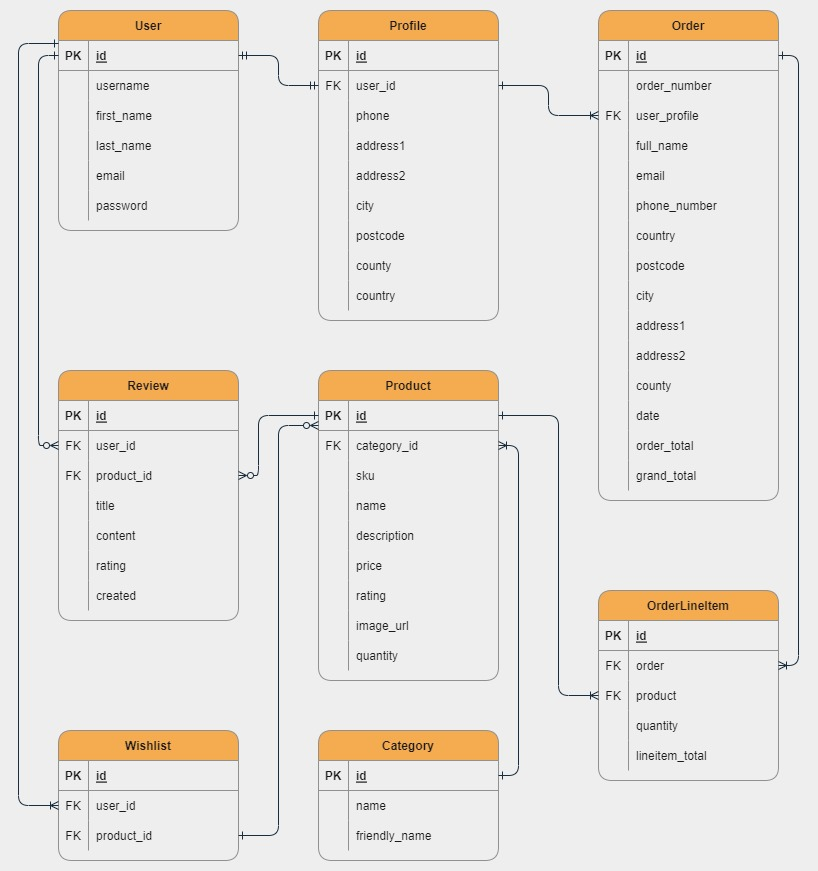
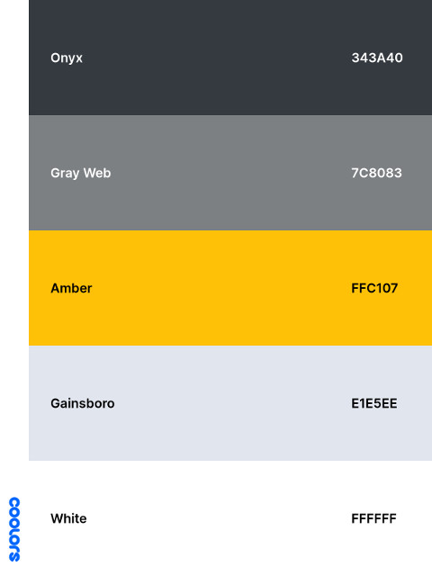

# [Honey2buy](https://honey2buy.herokuapp.com/)

This is an e-commerce website where hobby beekeepers from London and around can sell their honey and other honey bee products.

The healthy products will be sold in UK only and as a new business all deliveries will be free, as an atempt to form a hub of natural honey lovers.

A link to the live project can be found [here](https://honey2buy.herokuapp.com/).

This project was created in Django as my 5th project for my **Full stack Software Develompent** course from **[Code Institute](https://codeinstitute.net/)**

---

## Table of contents

1. [Business Model](#Business-Model)
2. [UX](#UX)
    - [User Stories](#User-Stories)
    - [Wireframes](#Wireframes)
    - [Database schema](#Database-schema)
    - [Style and colours](#Style-and-colours)
3. [Web marketing](#Web-marketing)
    - [SEO](#SEO)
    - [Social media marketing](#Social-media-marketing)
    - [Email marketing](#Email-marketing)
4. [Features](#Features)
    - [Existing Features](#Existing-Features)
        - [Feature1](#Feature1)
        - [Feature2](#Feature2)
        - [Feature3](#Feature3)
    - [Future Features](#Future-Features)
        - [Future Feature1](#Future-Feature1)
        - [Future Feature1](#Future-Feature1)
5. [Technologies Used](#Technologies-Used)
6. [Testing](#Testing)
7. [Deployment](#Deployment)
8. [Credits](#Credits)

---

## Business Model

The business model for this e-commerce store is B2C (Business to Customer) model. The customers are buying honey and honey bee products online for which they make individual card payments using stripe payment system.

[Back to top](#Table-of-contents)

---

## UX

Honey2buy e-commerce website was created using a Design Thinking and Agile software development approach.

For the Agile methodology GitHub Projects was used as a kanban board. The user stories were added as [issues](https://github.com/ChrisT-CC/H2B-PP5-ecommerce/issues), prioritised and automated to move to "To Do" column in [H2B-PP5-E-commerce](https://github.com/ChrisT-CC/H2B-PP5-ecommerce/projects/2). The issues can be assign to the contributors (if more then one-man-team) and can be commented on.

In "To Do" column individual task cards with subtasks checkboxes were also added to better keep track of the project's workflow

From "To Do" column the cards were moved to the "In progress" column based on current tasks

From "In progress" column, the cards were moved to "Done" column when the tasks were finished and tested

At the end of the project the issues can be closed. The remaining issues, if there are any, can be reassesed and relabeld (as future feature for example). In this project, the issues were not closed to be able to be used as proof of work.

Along with GitHub Projects, other tools or helpers were used, like: a spreadsheet, a pomodoro tracker and a good old notebook.

[Back to top](#Table-of-contents)

### User Stories

The [user stories](https://github.com/ChrisT-CC/H2B-PP5-ecommerce/issues) were used as an agile software development process to guide the development of the application. They were split in different categories and used as epics. MoSCoW prioritization was used after the user stories were written to identify the scope of the project, by adding labels: Must Have, Should Have, Could Have, Won't Have.

|  ID | AS A        |                           I WANT TO BE ABLE TO...                          | SO THAT I CAN...                                                                                |             |
|-----|-------------|:--------------------------------------------------------------------------:|-------------------------------------------------------------------------------------------------|-------------|
|     |             |                           **Viewing and navigation**                           |                                                                                                 |             |
|   1 | shopper     | see a list of products                                                     | select some of them to buy                                                                      | Must Have   |
|   2 | shopper     | view a specific category of products                                       | find products I want without having to search through all products                              | Must Have   |
|   3 | shopper     | view individual product details                                            | find details like: price, description, rating, image/s, availability                            | Must Have   |
|   4 | shopper     | identify special offers                                                    | take advantage of special savings                                                               | Should Have |
|   5 | shopper     | see the total of my purchases                                              | keep an eye on my expences                                                                      | Must Have   |
|   6 | shopper     | see a notification bubble next to my shopping cart                         | see if and how many items I have in the cart                                                    | Could Have  |
|   7 | shopper     | save products I like                                                       | check my favorite products                                                                      | Should Have |
|   8 | shopper     | review products                                                            | give feedback to other users or owner                                                           |             |
|     |             |                      **Honey and beekeeping information**                      |                                                                                                 |             |
|   9 | site user   | find information about local honey and honey bees                          | improve my knoledge and take informed decissions when buying and using honey and honey products | Must Have   |
|  10 | site user   | see a list of practical gardening and honey bee related advices and videos | understand and get involved with local beekeeping if I want to                                  | Should Have |
|  11 | site user   | see a section of dedicated beekeeping events                               | participate if want to                                                                          | Could Have  |
|  12 | site user   | register to a periodical newsletter                                        | receive personalized offers and information about honey and beekeeping                          | Must Have   |
|     |             |                       **Registration and User Accounts**                       |                                                                                                 |             |
|  13 | site user   | register for an account                                                    | have a personal account and view my profile                                                     | Must Have   |
|  14 | site user   | login or logout                                                            | access and use my personal info                                                                 | Must Have   |
|  15 | site user   | receive an email confirmation at registration                              | get successful registration feedbak                                                             | Must Have   |
|  16 | site user   | have a user profile                                                        | save payment info and view order history and order confirmations                                | Must Have   |
|     |             |                            **Sorting and Searching**                           |                                                                                   |             |
|  17 | shopper     | sort the list of products                                                  | check if a product is in stock or not                                                           | Must Have   |
|  18 | shopper     | search for a product by name, type or description                          | find a specific product                                                                         | Must Have   |
|     |             |                           **Purchasing and Checkout**                          |                                                                                                 |             |
|  19 | shopper     | view my shopping cart                                                      | check the total cost of my purchase and all items in it                                         | Must Have   |
|  20 | shopper     | select the quantity of a product when purchasing it                        | select the right product, quantity or size                                                      | Must Have   |
|  21 | shopper     | edit the quantity of items in my shopping cart                             | make changes to my purchase before checkout                                                     | Must Have   |
|  22 | shopper     | enter my payment information                                               | check out clearly and easily                                                                    | Must Have   |
|  23 | shopper     | view an order confirmation at checkout                                     | verify that I haven't made any mistakes                                                         | Must Have   |
|  24 | shopper     | receive an email confirmation after checking out                           | have a proof of purchase                                                                        | Must Have   |
|     |             |                          **Admin and Store Managment**                         |                                                                                                 |             |
|  25 | store owner | add a products and services                                                | add new items or services to my store                                                           | Must Have   |
|  26 | store owner | update individual products and services                                    | keep an up-to-date stock                                                                        | Must Have   |
|  27 | store owner | delete a product or service                                                | remove items or services that are no longer for sale                                            | Must Have   |
|  28 | store owner | display our privacy policy                                                 | guarantee our site users security                                                               | Should Have |
|  29 | store owner | post, edit and delete blog articles about beekeeping and honey             | improve my website's content                                                                    | Could Have  |
|  30 | store owner | post, edit and delete beekeeping videos                                    | teach beginner beekeepers how to care for honeybees                                             | Could Have  |
|  31 | store owner | edit and send newsletters to our members                                   | send offers, surveys or information about local honey and beekeeping                            | Must Have   |
|  32 | store owner | show business social media links                                           | help users connect with our bussines                                                            | Must Have   |

[Back to top](#Table-of-contents)

---

### Wireframes

The wireframes were created in [Balsamiq](https://balsamiq.com/). They were used to set an impression of how the website should look like. There are examples of three different screen sizes.

- Home page

- Products page

- Product Details page

- Cart page

- Checkout page

- Profile page

[Back to top](#Table-of-contents)

---

### Database schema

The db is based heavily on Code Institute's walkthrough project [Butique Ado](https://github.com/Code-Institute-Solutions/boutique_ado_v1) with a few modifications.

The models used are:

- User - Django default model
- Profile - BA model minus country field
- Order - BA model minus country, grand_total and delivery_cost fields
- OrderLineItem - BA model minus product_sizes field
- Product - BA model minus has_sizes field, plus quantity field
- Category - BA model unaltered
- Review - Custom built
- Wishlist - Custom built

You can see the models and relationships below:

[Back to top](#Table-of-contents)

---

### Style and colours

Honey2buy website uses minimalistic light styling. The colours used were inspired by honey bees colours, yelow and black. A combination of [Bootstrap 4](https://getbootstrap.com/docs/4.0/getting-started/introduction/) classes (dark, light and warning) were used to generate the colours of website with white as background. In addition, danger and primary classes were used to differentiate the refresh and bin icons in the shopping bag page.

[Back to top](#Table-of-contents)

---

## Web marketing

Because this is a new business I chose to use free web marketing strategies. The strategies used are:

- SEO and content marketing
- social media marketing
- email marketing

### SEO

Search Engine Optimization (SEO) refers to optimizing the web pages and content for better search engine rankings.

I tried my best to use **SEO techniques** learned, like: semantic HTML, minimizing keyword stuffing, using keywords in natural sentences in text content, using descriptive alt attribute for images, using description and keywords in metadata and using noopener in rel and descriptive aria-label attributes for external links.

The **keywords** used were both short-tail and long-tail keywords and were generated after a combinantion of brainstorming, analyzing business's type, needs and potential customers. The process continued with googling them, checking "related searches", "people also ask" sections and the autocomplete feature of google search bar.

- TO DO - robots.txt and sitemap.xml

[Back to top](#Table-of-contents)

### Social media marketing

The social media platform chosen for web marketing was Facebook, because it has the largest number of users and the widest demographic. A mockup Facebook business page was created in [Balsamiq](https://balsamiq.com/). The purpose of a Facebook bussines page is to get potential customers attention on the business and to promote company's products and services.

[Back to top](#Table-of-contents)

### Email marketing

Email marketing refers to using email to send direct marketing messages to people, in an effort to gain new customers or retain existing ones. This can be in the form of a regular newsletter, or emails to previous customers letting them know about new sales and promotions.

[Back to top](#Table-of-contents)

---

## Features

### Existing Features

- #### Feature1

[Back to top](#Table-of-contents)

---

- #### Feature2

[Back to top](#Table-of-contents)

---

- #### Feature3

[Back to top](#Table-of-contents)

---

### Future Features

- #### Favorite Feature 1

[Back to top](#Table-of-contents)

---

- #### Favorite Feature 2

[Back to top](#Table-of-contents)

---

- #### List of other future features

  - ff1
  - ff2
  - ff3

[Back to top](#Table-of-contents)

---

## Technologies Used

- [HTML](https://en.wikipedia.org/wiki/HTML) - used for creating templates
- [CSS](https://en.wikipedia.org/wiki/CSS) - used for custom styling
- [Bootstrap 4](https://getbootstrap.com/docs/4.0/getting-started/introduction/) - CSS Framework used for developing responsive and mobile-first websites
- [JavaScript](https://www.javascript.com/) - programming language used to make web pages interactive
- [Python](https://www.python.org/) - high-level general-purpose programming language used to write the code for the project
- [Django](https://www.djangoproject.com/) - Python framework used to build the project
- [Django Allauth](https://django-allauth.readthedocs.io/en/latest/index.html) - Django pre-built package used for authentification
- [django-crispy-forms](https://django-crispy-forms.readthedocs.io/en/latest/index.html#) - Django app used to manage Django forms
- [django-storages](https://django-storages.readthedocs.io/en/latest/) - Django library used to connect the project to Amazon S3 Bucket
- [Amazon S3 bucket](https://aws.amazon.com/s3/) - AWS web-based cloud storage service used for storing static and media files
- [Heroku](https://dashboard.heroku.com/apps) - cloud platform used for deployment
- [Stripe](https://stripe.com/en-gb) - used to take payments
- [Font Awesome](https://fontawesome.com/) - used for icons
- [Chrome Dev Tools](https://developers.google.com/web/tools/chrome-devtools) - used for manual testing and responsiveness
- [GitHub](https://github.com/) - used to host repo
- [Git](https://git-scm.com/) - used for version control
- [Gitpod](https://www.gitpod.io/) - used as IDE
- [Draw.io](https://app.diagrams.net/) - used to create ERD
- [PostgreSQL](https://www.postgresql.org/) - as database
- [Icon8](https://icons8.com/) - used for favicon
- [AmIResponsive](http://ami.responsivedesign.is/) - used for responsive image mockup
- [Django Secret Key Generator](https://miniwebtool.com/django-secret-key-generator/) - used to generate secret keys pr the project
- [Colorzilla](https://www.colorzilla.com/) - color picker chrome extension
- [Coolors](https://coolors.co/) - colour palette generator
- [GIMP](https://www.gimp.org/) - image editor
- [Compressjpeg](https://compressjpeg.com/) - used for compressing image files  to maximise loading speed

[Back to top](#Table-of-contents)

---

## Testing

Testing was done...

### Found bugs

- #### bug1

- #### bug2

- #### bug3

[Back to top](#Table-of-contents)

---

## Deployment

The project's repo was hosted on GitHub and it was deployed on Heroku

### Heroku Setup and CLI

Unfortunately, deploying to GitHub Pages won't work, since it can only handle front-end files such as HTML, CSS, and JavaScript. So the project needs to be deployed to a hosting platform that can render Python files. One such platform is [Heroku](https://id.heroku.com/login).

- sign up / login to [Heroku](https://id.heroku.com/login) website
- if necessary, install the heroku CLI in Gitpod: `curl https://cli-assets.heroku.com/install.sh | sh`
- login to Heroku CLI: `heroku login -i`

### Installing Project Requirements

Because Heroku uses an ephemeral file system, we can't use the local `db.sqlite3` database. We use instead a database called Postgres.

- install Postgres: `pip3 install psycopg2-binary`
- install webserver: `pip3 install gunicorn` - replaces the development server once the app is deployed to Heroku
- create a requirements file: `pip3 freeze --local > requirements.txt` - creates a file to let heroku know which packages to install

### Creating a Heroku App

A Heroku app can be created in CLI or on [Heroku website](https://id.heroku.com)

- create the app in CLI: `heroku apps:create app-name --region eu`
- view the apps in CLI: `heroku apps`
- view the key remotes in CLI: `git remote -v`

### Creating a New Database on Heroku

The database is created on heroku website.

- in heroku app under the "Resources" tab, underneath the "Add-ons" section type `heroku postgress`
- choose `Hobby Dev - Free` option
- in "Settings" press "Reveal Config Vars" to see see that Heroku has created a DATABASE_URL for us to connect to from inside Django
- to see it in CLI type: "heroku addons"

**Important** - If you want to create this database with MySql instead of Postgres use DB add-on.

### Connecting to Our Remote Database

Set up the Django app to connect to the remote database.

- install a database url package: `pip3 install dj-database-url` - this package allows us to parse the database url that Heroku created
- refreeze the requirements file: `pip3 freeze --local > requirements.txt`
- get the url of the remote database in CLI: `heroku config -a app-name`
- in `settings.py` modify the original "DATABASE" settings to replace the value of the default database with the database url from Heroku
- import "dj_database_url"
- run migrations: `python3 manage.py migrate`
- update `.gitignore`

### Connecting Heroku to Github

By connecting Heroku to Github the application will automatically deploy the latest code to Heroku.

- in heroku app, open app, in "Deploy" tab, under the "Deployment method" setting select "GitHub"
- search for repository and click "Connect"
- choose "Enable Automatic Deploys"
- modify `settings.py` to use environment variables
- add the environment variables to Heroku
- confirm Heroku to Github connection

### The Development Environment

Set up a local development environment so that you don't have to change any settings to run the project in gitpod.

- modify `settings.py`:
  - create a new "development" variable
  - set "Debug" to development
  - modify the "DATABASES" configuration and add an if statement
  - add a "localhost" as an ALLOWED_HOST if development = True
  - else use the HEROKU_HOSTNAME environment variable
- add a new environment variable set to TRUE
- restart workspace
- run server

### Config vars

A series of config vars have to be created in Heroku, to conect the app to Django, AWS, stripe and email.

The final list of config vars in Heroku can be seen below

### Github

Create a new repository

- Log into [GitHub](https://github.com/)
- On the 'Repositories' tab click 'New'
- Name the repository and click 'Create repository'

#### Forking

- Sign into Github and go to my [repo](https://github.com/ChrisT-CC/H2B-PP5-ecommerce)
- Press the "Fork" button the top right corner of page
- Click "Create fork"

#### Cloning

- Sign in to Github and go to my [repo](https://github.com/ChrisT-CC/H2B-PP5-ecommerce)
- Above the list of files click "Code"
- Select HTTPS, SSH or Github CLI, then click the copy button to get the URL
- Open your IDE of choice
- Type "git clone" and then paste the URL you copied
- Press Enter

[Cloning a repository In GitHub documantation](https://docs.github.com/en/repositories/creating-and-managing-repositories/cloning-a-repository)

[Back to top](#Table-of-contents)

---

## Credits

### Content

Code Institute's walkthrough project [Butique Ado](https://github.com/Code-Institute-Solutions/boutique_ado_v1) was heavily used to create this project.

The [Django documentation](https://docs.djangoproject.com/en/3.2/) was very helpful.

Other projects where I looked for inspiration:

- Dennis Ivy's [Django Ecommerce Website](https://www.youtube.com/playlist?list=PL-51WBLyFTg0omnamUjL1TCVov7yDTRng)
- JustDjango's [Build an Ecommerce Website with Django](https://www.youtube.com/playlist?list=PLLRM7ROnmA9F2vBXypzzplFjcHUaKWWP5)

### Media

Most of the images used came from [Pexels.com](https://www.pexels.com/). The majority of products images came from two real websites [littleoverapiaries.com](https://www.littleoverapiaries.com/shop/) and [apidae.co.uk](https://www.apidae.co.uk/englishhoney). The images were edited in [GIMP](https://www.gimp.org/) and compressed in [Compressjpeg](https://compressjpeg.com/). There is a detailed brakedown below.

|   Images                 |           Source                            |
|--------------------------|---------------------------------------------|
| Favicon | [icon8.com](https://icons8.com/icons/set/honey) |
| Logo image | [freepick.com](https://www.freepik.com/free-vector/honey-lettering-with-bees_7997317.htm#query=honey%20logo&position=21&from_view=search) |
| Landing honeycomb image | [Photo by Archana GS from Pexels](https://www.pexels.com/photo/close-up-photo-of-honey-comb-4111270/?utm_content=attributionCopyText&utm_medium=referral&utm_source=pexels) |
| Collage top left image | [Photo by Mareefe from Pexels](https://www.pexels.com/photo/clear-glass-bowl-beside-yellow-flower-1638280/?utm_content=attributionCopyText&utm_medium=referral&utm_source=pexels) |
| Collage top right image | [Photo by Quang Nguyen Vinh from Pexels](https://www.pexels.com/photo/apiary-in-a-forest-11334353/?utm_content=attributionCopyText&utm_medium=referral&utm_source=pexels) |
| Collage center image | [Photo by David Hablützel from Pexels](https://www.pexels.com/photo/bee-and-beehive-928978/?utm_content=attributionCopyText&utm_medium=referral&utm_source=pexels) |
| Collage bottom left image | [Photo by furkanvari from Pexels](https://www.pexels.com/photo/photograph-of-beehives-near-flowers-4034986/?utm_content=attributionCopyText&utm_medium=referral&utm_source=pexels) |
| Collage bottom right image |[Photo by Dmitry Glazunov from Pexels](https://www.pexels.com/photo/close-up-photo-of-beekeeper-holding-a-swarm-of-honey-bees-in-a-hive-frame-4247181/?utm_content=attributionCopyText&utm_medium=referral&utm_source=pexels) |
| FB mockup main image | [Photo by Mật from Pexels](https://www.pexels.com/photo/glass-jars-and-a-honey-dipper-on-a-wooden-tray-9105966/?utm_content=attributionCopyText&utm_medium=referral&utm_source=pexels) |
| Honeycomb in honey jar | [freeimages.com](https://www.freeimages.com/photo/sweet-as-honey-1550169) |
| Jar of pollen | [freepick.com](https://www.freepik.com/free-photo/medicine-food-bee-pollen_10464255.htm#query=pollen%20granules&position=11&from_view=search) |
| Mixed nuts honey jar | [thewoodenspoon.co.uk](https://www.thewoodenspoon.co.uk/curds-honeys-gingers/) |
| Products images 1 | [littleoverapiaries.com](https://www.littleoverapiaries.com/shop/) |
| Products images 2 | [apidae.co.uk](https://www.apidae.co.uk/englishhoney) |
| Footer image | [freepick.com](https://www.freepik.com/free-vector/technological-honeycomb-black-golden-background_5329985.htm#query=honey%20logo&position=16&from_view=search) |

### Acknowledgements

Thanks to my mentor for help, suggetions and time

Thanks to Sean from CI Tutor assistance for help

Thanks to my family, friends and peers for suggestions, reviews and feedback

[Back to top](#Table-of-contents)

---

### *Disclaimer: This project is for learning purposes only*
