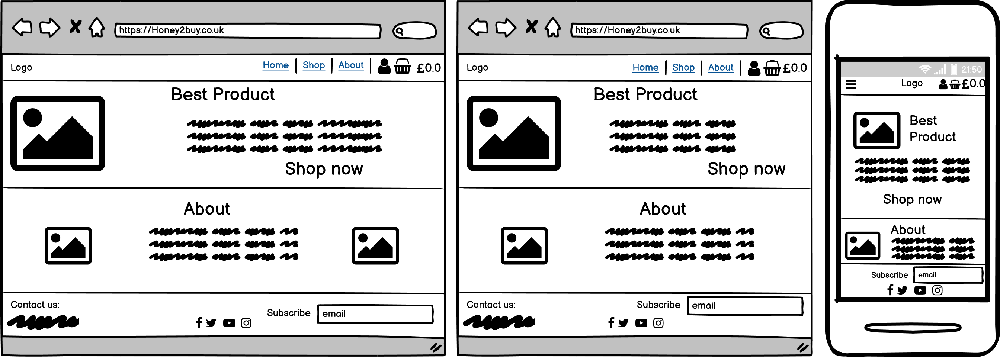

# [Honey2buy](https://honey2buy.herokuapp.com/)

This is an e-commerce website where hobby beekeepers from London and around can sell their honey and other honey bee products.

The healthy products will be sold in UK only and as a new business all deliveries will be free, as an atempt to form a hub of natural honey lovers.

A link to the live project can be found [here](https://honey2buy.herokuapp.com/).

This project was created in Django as my 5th project for my **Full stack Software Develompent** course from **[Code Institute](https://codeinstitute.net/)**

---

## Table of contents

1. [UX](#UX)
    - [User Stories](#User-Stories)
    - [Wireframes](#Wireframes)
    - [Database schema](#Database-schema)
    - [Style and colours](#Style-and-colours)
2. [Web marketing](#Web-marketing)
    - [SEO](SEO)
    - [Social media marketing](#Social-media-marketing)
    - [Email marketing](#Email-marketing)
3. [Features](#Features)
    - [Existing Features](#Existing-Features)
        - [Feature1](#Feature1)
        - [Feature2](#Feature2)
        - [Feature3](#Feature3)
    - [Future Features](#Future-Features)
        - [Future Feature1](#Future-Feature1)
        - [Future Feature1](#Future-Feature1)
4. [Technologies Used](#Technologies-Used)
5. [Testing](#Testing)
6. [Deployment](#Deployment)
7. [Credits](#Credits)

---

## UX

---

### User Stories

[Back to top](#Table-of-contents)

---

### Wireframes

The wireframes were created in [Balsamiq](https://balsamiq.com/). They were used to set an impression of how the website should look like. There are examples of three different screen sizes.

- Home page

- Products page

- Product Details page

- Cart page

- Checkout page

- Profile page

[Back to top](#Table-of-contents)

---

### Database schema

[Back to top](#Table-of-contents)

---

### Style and colours

[Back to top](#Table-of-contents)

---

## Web marketing

Because this is a new business I chose to use free web marketing strategies. The strategies used are:

- SEO and content marketing
- social media marketing
- email marketing

### SEO

Search Engine Optimization (SEO) refers to optimizing the web pages and content for better search engine rankings.

I tried my best to use **SEO techniques** learned, like: semantic HTML, minimizing keyword stuffing, using keywords in natural sentences in text content, using descriptive alt attribute for images, using description and keywords in metadata and using noopener in rel and descriptive aria-label attributes for external links.

The **keywords** used were both short-tail and long-tail keywords and were generated after a combinantion of brainstorming, analyzing business's type, needs and potential customers. The process continued with googling them, checking "related searches", "people also ask" sections and the autocomplete feature of google search bar.

- TO DO - robots.txt and sitemap.xml

[Back to top](#Table-of-contents)

### Social media marketing

The social media platform chosen for web marketing was Facebook, because it has the largest number of users and the widest demographic. A mockup Facebook business page was created in [Balsamiq](https://balsamiq.com/). The purpose of a Facebook bussines page is to get potential customers attention on the business and to promote company's products and services.

[Back to top](#Table-of-contents)

### Email marketing

Email marketing refers to using email to send direct marketing messages to people, in an effort to gain new customers or retain existing ones. This can be in the form of a regular newsletter, or emails to previous customers letting them know about new sales and promotions.

[Back to top](#Table-of-contents)

---

## Features

### Existing Features

- #### Feature1

[Back to top](#Table-of-contents)

---

- #### Feature2

[Back to top](#Table-of-contents)

---

- #### Feature3

[Back to top](#Table-of-contents)

---

### Future Features

- #### Favorite Feature 1

[Back to top](#Table-of-contents)

---

- #### Favorite Feature 2

[Back to top](#Table-of-contents)

---

- #### List of other future features

  - ff1
  - ff2
  - ff3

[Back to top](#Table-of-contents)

---

## Technologies Used

- [HTML](https://en.wikipedia.org/wiki/HTML) - used for creating templates
- [CSS](https://en.wikipedia.org/wiki/CSS) - used for custom styling
- [Bootstrap 4](https://getbootstrap.com/docs/4.0/getting-started/introduction/) - CSS Framework used for developing responsive and mobile-first websites
- [JavaScript](https://www.javascript.com/) - programming language used to make web pages interactive
- [Python](https://www.python.org/) - high-level general-purpose programming language used to write the code for the project
- [Django](https://www.djangoproject.com/) - Python framework used to build the project
- [Django Allauth](https://django-allauth.readthedocs.io/en/latest/index.html) - Django pre-built package used for authentification
- [django-crispy-forms](https://django-crispy-forms.readthedocs.io/en/latest/index.html#) - Django app used to manage Django forms
- [django-storages](https://django-storages.readthedocs.io/en/latest/) - Django library used to connect the project to Amazon S3 Bucket
- [Amazon S3 bucket](https://aws.amazon.com/s3/) - AWS web-based cloud storage service used for storing static and media files
- [Heroku](https://dashboard.heroku.com/apps) - cloud platform used for deployment
- [Stripe](https://stripe.com/en-gb) - used to take payments
- [Font Awesome](https://fontawesome.com/) - used for icons
- [Chrome Dev Tools](https://developers.google.com/web/tools/chrome-devtools) - used for manual testing and responsiveness
- [GitHub](https://github.com/) - used to host repo
- [Git](https://git-scm.com/) - used for version control
- [Gitpod](https://www.gitpod.io/) - used as IDE
- [Draw.io](https://app.diagrams.net/) - used to create ERD
- [PostgreSQL](https://www.postgresql.org/) - as database
- [Icon8](https://icons8.com/) - used for favicon
- [AmIResponsive](http://ami.responsivedesign.is/) - used for responsive image mockup
- [Django Secret Key Generator](https://miniwebtool.com/django-secret-key-generator/) - used to generate secret keys pr the project
- [Colorzilla](https://www.colorzilla.com/) - color picker chrome extension
- [Coolors](https://coolors.co/) - colour palette generator
- [GIMP](https://www.gimp.org/) - image editor
- [Compressjpeg](https://compressjpeg.com/) - used for compressing image files  to maximise loading speed

[Back to top](#Table-of-contents)

---

## Testing

Testing was done...

### Found bugs

- #### bug1

- #### bug2

- #### bug3

---

## Deployment

[Back to top](#Table-of-contents)

---

## Credits

### Content

### Acknowledgements

[Back to top](#Table-of-contents)

---

### *Disclaimer: This project is for learning purposes only*
